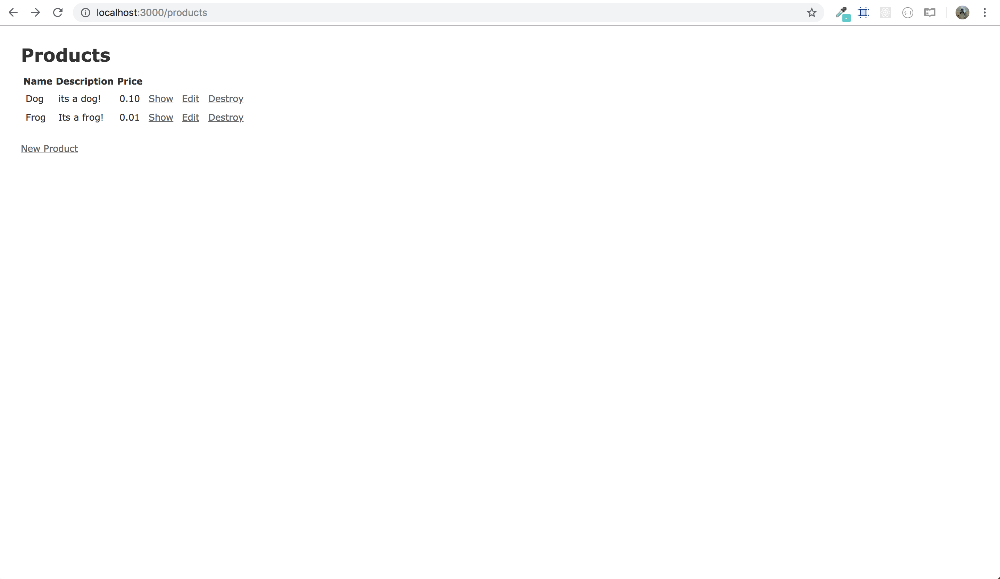
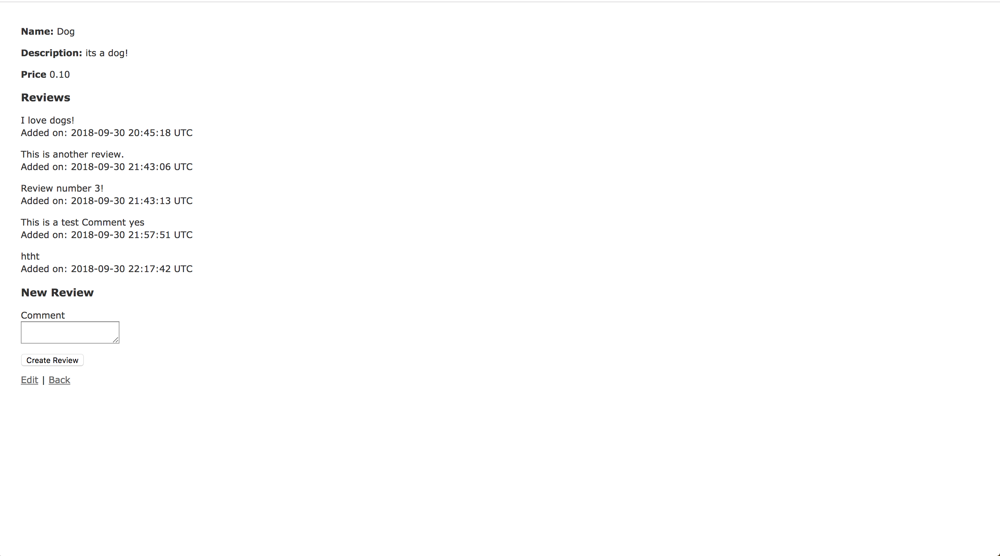

# Wyncode-Project7-Rails-MVC

My seventh weekend project at Wyncode Academy in Miami, FL.

* We had create an E-Commerce site using Ruby on Rails. 
* This project helped me to gain familiarity with the RESTful actions as well as the MVC architectural pattern.

### *index* Action

### *show* Action

